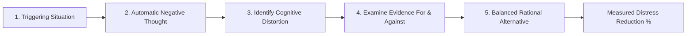
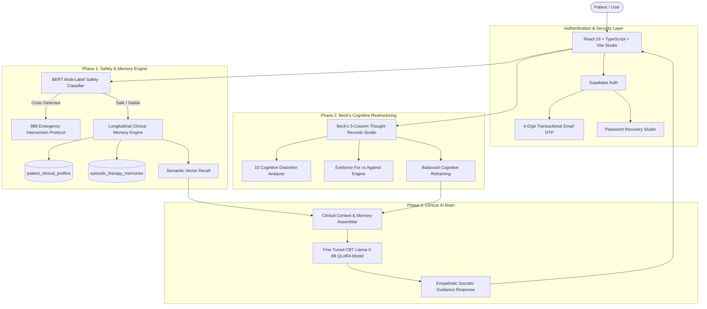

# 🧠 Better Me: Clinical CBT Companion & Longitudinal AI Memory Platform

> **BS Final Year Project (FYP)**  
> **Institution:** Department of Computer Science & Software Engineering  
> **Project Supervisor:** Mam Farnaz Akbar  
> **Team Members:**  
> - **Awais Khan**  
> - **Saad Abdullah**  
> - **Ajiya Asif**  

---

## 📌 Executive Summary & Clinical Vision

Most modern AI chatbots (e.g., standard ChatGPT, generic LLM wrappers) fail in mental healthcare because they suffer from **three critical limitations**:
1. **Conversational Amnesia:** They do not maintain a longitudinal psychological understanding of the user across sessions.
2. **Sycophantic Agreement:** They validate every emotion passively rather than actively challenging cognitive errors and dysfunctional core beliefs.
3. **Lack of Clinical Structure:** They provide free-form advice rather than structured, evidence-based psychological exercises.

**Better Me** bridges this gap by transforming conversational AI from an "open-ended chatbot" into a **structured, clinical-grade Cognitive Behavioral Therapy (CBT) platform**. It integrates **Aaron T. Beck’s cognitive model**, **longitudinal clinical memory indexing**, **BERT-powered psychiatric risk classification**, and a **fine-tuned open-source Llama-3-8B-Instruct model (via 4-bit QLoRA)** trained exclusively on psychotherapeutic dialogues.

---

## 🏛️ System Architecture


---

## 🔬 Core Implementation Phases

### 🔹 Phase 1: Longitudinal Clinical Memory Engine & Safety Triage
A genuine therapist does not treat a patient as a stranger in every appointment. Phase 1 provides **stateful continuity**:

1. **`patient_clinical_profiles`**:
   - Stores baseline diagnostic intake (PHQ-9 Depression, GAD-7 Anxiety scores, chronic stressors, attachment styles, coping mechanisms).
   - Tracks primary cognitive schemas (e.g., *"Defectiveness"*, *"Abandonment"*, *"Unrelenting Standards"*).
2. **`episodic_therapy_memories`**:
   - Automatically synthesizes session milestones, recurring cognitive patterns, emotional volatility, and breakthroughs.
   - Uses semantic vector embeddings to retrieve relevant past insights when the patient discusses familiar triggers weeks or months later.
3. **Clinical Safety & Crisis Triage**:
   - BERT safety classifier scans every user input prior to LLM processing.
   - If severe suicidal ideation or self-harm triggers are detected, the system bypasses free-form generative LLMs and immediately provides **24/7 Crisis Hotline Protocols (988, Emergency Lifeline)**.

---

### 🔹 Phase 2: Beck's 5-Column Thought Records Studio
#### 💡 Why Was This Implemented? (Clinical & Technical Justification)
In cognitive behavioral therapy founded by **Dr. Aaron T. Beck**, thoughts determine feelings and behaviors—not the external event itself:
$$\text{Event / Situation} \longrightarrow \text{Automatic Thoughts} \longrightarrow \text{Emotional & Behavioral Reaction}$$

Depression and anxiety are perpetuated by **Cognitive Distortions** (systematic systematic biases in information processing). Merely "talking" to an AI does not break these neural thought patterns. Patients need **active, rigorous cognitive restructuring**.

#### 📋 The 5-Column Architecture Implemented in Better Me (`/thought-records`):

| Column # | Phase Name | Clinical Purpose | Implementation in Better Me |
| :--- | :--- | :--- | :--- |
| **Col 1** | **Situation** | Pinpoint the objective triggering event without judgment. | User logs who, where, when, and what happened objectively. |
| **Col 2** | **Automatic Thoughts** | Capture raw unconscious negative self-talk. | User records instinctive thoughts and rates emotional intensity (0–100%). |
| **Col 3** | **Distortion Classifier** | Identify specific cognitive biases. | AI and user categorize thoughts into Beck's 10 distortions (Catastrophizing, Mind Reading, Black-and-White, etc.). |
| **Col 4** | **Evidence Examination** | Rigorously separate fact from feeling. | Two-column clinical analysis: **Evidence Supporting** vs. **Evidence Contradicting** the negative thought. |
| **Col 5** | **Balanced Alternative** | Formulate a realistic, resilient cognition. | Generates a balanced thought; user re-rates post-exercise distress (e.g., 85% drops to 25%). |



#### 🛡️ Cognitive Distortions Handled by the Studio:
1. **All-or-Nothing Thinking:** Viewing scenarios in absolute black-and-white categories.
2. **Catastrophizing:** Magnifying the worst possible outcome as inevitable.
3. **Mind Reading:** Arbitrarily presuming negative judgments from others without proof.
4. **Emotional Reasoning:** Believing something is true solely because it *feels* true.
5. **Overgeneralization:** Treating a single negative event as an endless pattern of defeat.
6. **"Should" / "Must" Statements:** Rigid self-imposed rules causing guilt and frustration.
7. **Mental Filter:** Fixating exclusively on a negative detail while ignoring positive facts.
8. **Disqualifying the Positive:** Rejecting positive experiences by insisting they "don't count".
9. **Personalization:** Blaming oneself for events outside personal control.
10. **Labeling:** Attaching universal negative labels to oneself (*"I'm a failure"* instead of *"I made an error"*).

---

### 🔹 Phase 3: Fine-Tuned Domain-Specific LLM (Llama-3-8B-Instruct QLoRA)
#### 💡 Why Fine-Tuned Open-Source vs Commercial APIs?
1. **Patient Data Confidentiality & Sovereignty:** Mental health conversations contain intimate psychological records. Commercial APIs log prompt histories; open-source weights can be self-hosted on private infrastructure.
2. **Therapeutic Tone Alignment:** Vanilla LLMs tend to be overly verbose, advice-heavy, and sycophantic. A CBT therapist employs **Socratic Dialogue** (guided questioning to help the patient discover alternative perspectives).
3. **Deterministic Safety Guardrails:** Fine-tuning on clinical datasets constrains the model from offering pharmacological or medical prescriptions while enforcing empathetic boundaries.

#### ⚙️ Training Specifications:
- **Base Foundation Model:** `meta-llama/Meta-Llama-3-8B-Instruct`
- **Methodology:** 4-bit Parameter-Efficient Fine-Tuning (PEFT) using **QLoRA** (Quantized Low-Rank Adaptation).
- **Target Projection Layers:** `q_proj`, `k_proj`, `v_proj`, `o_proj`, `gate_proj`, `up_proj`, `down_proj`.
- **Hyperparameters:** LoRA Rank $r=16$, LoRA Alpha $\alpha=32$, Dropout $0.05$.
- **Training Dataset:** Custom-curated `cbt_dataset.json` containing multi-turn Socratic CBT clinical dialogues.
- **Hugging Face Model Weights:** [`awaiskhan4039/better-me-cbt-llama3-lora`](https://huggingface.co/awaiskhan4039/better-me-cbt-llama3-lora)
- **Training Script:** [`backend/training/train_cbt_llama3_colab.ipynb`](../backend/training/train_cbt_llama3_colab.ipynb)

---

## 🔐 Authentication, Security & UI Enhancements

### 1. 6-Digit Email OTP Verification (Supabase)
To ensure legitimate patient identity and verify transactional email communication:
- Registration dispatches a transactional 6-digit verification code to the user's email via Supabase.
- User is automatically routed to `/verify-otp?email=...`.
- Flow is strictly sequenced:
  $$\text{Sign Up} \longrightarrow \text{6-Digit Email OTP} \longrightarrow \text{Verify OTP} \overset{\text{Success}}{\longrightarrow} \text{5-Step Clinical Assessment (/onboarding)}$$

### 2. Complete Password Recovery Studio
- **Forgot Password (`/forgot-password`):** User inputs email; Supabase sends a 6-digit recovery OTP code or direct link.
- **In-App Reset Flow:** Users enter the 6-digit code alongside a new password, validated directly through `supabase.auth.verifyOtp({ type: 'recovery' })` and `supabase.auth.updateUser(...)`.
- **Direct Link Fallback (`/reset-password`):** Handles recovery tokens from email clicks.

### 3. Eye Icon Password Visibility Toggles
- Interactive Show/Hide password toggles (`Eye` / `EyeOff` icons) integrated across **Login**, **Register**, **Forgot Password**, and **Reset Password**.

### 4. Floating Animated Therapeutic Logo (`AuthLogo.tsx`)
- Micro-animated floating motion (`animate-float`) conveying calm, breathing presence.
- Ambient pulsing aurora glow (`animate-pulse-glow`).
- Live active green pulse beacon symbolizing an online, available companion.
- Academic FYP Attribution capsules honoring group members and supervisor.

---

## 📁 Repository Structure

```
Better Me-App-FYP/
├── README.md                                 # Master Project Documentation
├── CBT JSON Templates/                       # Clinical CBT taxonomy & question frameworks
├── Models/                                   # Local ML model weights & tokenizer caches
├── backend/                                  # FastAPI & Clinical AI Services
│   ├── app/
│   │   ├── api/
│   │   │   ├── endpoints/
│   │   │   │   ├── auth.py                   # User authentication & profile endpoints
│   │   │   │   ├── conversations.py          # Session management & memory retrieval
│   │   │   │   ├── thought_records.py        # 5-Column Thought Record CRUD & analytics
│   │   │   │   ├── intake.py                 # Initial clinical assessment intake
│   │   │   │   ├── analyze.py                # Cognitive distortion classifier
│   │   │   │   └── analytics.py              # Patient progress tracking
│   │   │   └── router.py                     # API router aggregation
│   │   ├── core/config.py                    # Environment & model configurations
│   │   ├── db/
│   │   │   ├── database.py                   # SQLAlchemy engine & session factory
│   │   │   ├── phase1_clinical_memory_schema.sql # Longitudinal memory schemas
│   │   │   └── repositories/                 # Database data access layer
│   │   └── services/
│   │       ├── llm/
│   │       │   ├── huggingface_provider.py   # Llama-3-8B QLoRA inference client
│   │       │   └── __init__.py
│   │       └── llm_service.py                # Prompt assembly & safety guardrails
│   ├── training/
│   │   ├── cbt_dataset.json                  # Clinical CBT training dataset
│   │   ├── train_cbt_llama3_colab.ipynb      # Google Colab QLoRA fine-tuning notebook
│   │   └── train_cbt_llama3_colab.py         # Standalone training script
│   └── main.py                               # FastAPI application entrypoint
│
└── Frontend_App/                             # Modern React 19 Client Application
    ├── src/
    │   ├── app/
    │   │   ├── components/
    │   │   │   ├── AuthLogo.tsx              # Floating animated logo & live beacon
    │   │   │   └── ui/                       # Accessible UI components (Shadcn/Tailwind)
    │   │   ├── pages/
    │   │   │   ├── Landing.tsx               # Public introduction & academic credits
    │   │   │   ├── Login.tsx                 # Patient authentication & OTP check
    │   │   │   ├── Register.tsx              # Registration & OTP dispatch
    │   │   │   ├── VerifyOtp.tsx             # 6-Digit email verification
    │   │   │   ├── ForgotPassword.tsx        # Password recovery via OTP
    │   │   │   ├── ResetPassword.tsx         # Password reset via recovery link
    │   │   │   ├── OnboardingAssessment.tsx  # 5-Step Clinical Intake (PHQ-9/GAD-7)
    │   │   │   ├── Dashboard.tsx             # Patient hub, mood tracker, recent insights
    │   │   │   ├── ChatTherapy.tsx           # Socratic AI CBT conversation studio
    │   │   │   ├── ThoughtRecords.tsx        # Beck's 5-Column Cognitive Restructuring
    │   │   │   └── Progress.tsx              # Longitudinal mood & distortion trends
    │   │   ├── routes.ts                     # React Router 7 page routing table
    │   │   └── services/
    │   │       ├── apiService.ts             # Backend FastAPI HTTP client
    │   │       └── supabaseClient.ts         # Supabase client singleton
    │   └── styles/
    │       ├── theme.css                     # Custom animations (float, pulse-glow, blobs)
    │       └── index.css                     # Master stylesheet
    ├── vite.config.ts                        # Vite bundler configuration
    └── package.json                          # Frontend dependencies
```

---

## 🚀 Installation & Local Development Guide

### 1. Prerequisites
- **Node.js** $\ge$ 18.x
- **Python** $\ge$ 3.10
- **PostgreSQL / Supabase** account
- **Hugging Face Account** (with read access to Meta Llama-3)

---

### 2. Frontend Quick Start (React & Vite)

1. Open a terminal in the `Frontend_App` directory:
   ```bash
   npm install
   npm run dev
   ```
2. Application runs at: `http://localhost:5173`

---

## 🎓 FYP Presentation & Viva Defense Talking Points

When presenting **Better Me** to your project supervisor (**Mam Farnaz Akbar**) or external evaluators, highlight these core pillars:

### 1. Awais Khan — AI/ML Architecture & Model Fine-Tuning
- **Key Message:** *"We did not simply build an API wrapper around OpenAI. We addressed medical privacy and therapeutic tone by fine-tuning an open-source 8-billion parameter model (Llama-3-8B) on Google Colab using 4-bit QLoRA. Our model learned Socratic questioning instead of generic conversational replies."*

### 2. Saad Abdullah — Phase 1 & 2 Clinical Memory Engine and Thought Records
- **Key Message:** *"Our breakthrough is moving from amnesic chat to clinical continuity. We built Aaron Beck’s 5-Column Cognitive Restructuring exercise into an interactive studio (`/thought-records`). It allows patients to identify their cognitive distortions, examine supporting and contradictory evidence, and measure the drop in distress."*

### 3. Ajiya Asif — Patient Journey, Clinical Assessment & Security Pipeline
- **Key Message:** *"We designed a clinically validated patient intake based on PHQ-9 and GAD-7 standards. Security is critical in psychological applications: every user is verified via a 6-digit transactional email OTP, and an automated BERT triage model constantly guards against acute psychiatric crises."*

---

## 📄 License & Ethical Medical Disclaimer

**Disclaimer:**  
*Better Me is an academic research system designed for psychoeducational support and cognitive reframing. It is not an automated medical diagnostic tool and does not substitute for licensed psychiatric or clinical psychological treatment. In life-threatening emergencies or acute crises, immediate assistance should be sought through professional emergency services or confidential hotlines (e.g., 988).*

---
<p align="center">
  <strong>Developed with ❤️ by Awais Khan, Saad Abdullah, and Ajiya Asif</strong><br>
  <em>Supervised by Mam Farnaz Akbar — BS Final Year Project 2026</em>
</p># 🧠 Better Me: Clinical CBT Companion & Longitudinal AI Memory Platform

> **BS Final Year Project (FYP)**  
> **Institution:** Department of Computer Science & Software Engineering  
> **Project Supervisor:** Mam Farnaz Akbar  
> **Team Members:**  
> - **Awais Khan**  
> - **Saad Abdullah**  
> - **Ajiya Asif**  

---

## 📌 Executive Summary & Clinical Vision

Most modern AI chatbots (e.g., standard ChatGPT, generic LLM wrappers) fail in mental healthcare because they suffer from **three critical limitations**:
1. **Conversational Amnesia:** They do not maintain a longitudinal psychological understanding of the user across sessions.
2. **Sycophantic Agreement:** They validate every emotion passively rather than actively challenging cognitive errors and dysfunctional core beliefs.
3. **Lack of Clinical Structure:** They provide free-form advice rather than structured, evidence-based psychological exercises.

**Better Me** bridges this gap by transforming conversational AI from an "open-ended chatbot" into a **structured, clinical-grade Cognitive Behavioral Therapy (CBT) platform**. It integrates **Aaron T. Beck’s cognitive model**, **longitudinal clinical memory indexing**, **BERT-powered psychiatric risk classification**, and a **fine-tuned open-source Llama-3-8B-Instruct model (via 4-bit QLoRA)** trained exclusively on psychotherapeutic dialogues.

---

## 🏛️ System Architecture



---

## 🔬 Core Implementation Phases

### 🔹 Phase 1: Longitudinal Clinical Memory Engine & Safety Triage
A genuine therapist does not treat a patient as a stranger in every appointment. Phase 1 provides **stateful continuity**:

1. **`patient_clinical_profiles`**:
   - Stores baseline diagnostic intake (PHQ-9 Depression, GAD-7 Anxiety scores, chronic stressors, attachment styles, coping mechanisms).
   - Tracks primary cognitive schemas (e.g., *"Defectiveness"*, *"Abandonment"*, *"Unrelenting Standards"*).
2. **`episodic_therapy_memories`**:
   - Automatically synthesizes session milestones, recurring cognitive patterns, emotional volatility, and breakthroughs.
   - Uses semantic vector embeddings to retrieve relevant past insights when the patient discusses familiar triggers weeks or months later.
3. **Clinical Safety & Crisis Triage**:
   - BERT safety classifier scans every user input prior to LLM processing.
   - If severe suicidal ideation or self-harm triggers are detected, the system bypasses free-form generative LLMs and immediately provides **24/7 Crisis Hotline Protocols (988, Emergency Lifeline)**.

---

### 🔹 Phase 2: Beck's 5-Column Thought Records Studio
#### 💡 Why Was This Implemented? (Clinical & Technical Justification)
In cognitive behavioral therapy founded by **Dr. Aaron T. Beck**, thoughts determine feelings and behaviors—not the external event itself:
$$\text{Event / Situation} \longrightarrow \text{Automatic Thoughts} \longrightarrow \text{Emotional & Behavioral Reaction}$$

Depression and anxiety are perpetuated by **Cognitive Distortions** (systematic systematic biases in information processing). Merely "talking" to an AI does not break these neural thought patterns. Patients need **active, rigorous cognitive restructuring**.

#### 📋 The 5-Column Architecture Implemented in Better Me (`/thought-records`):

| Column # | Phase Name | Clinical Purpose | Implementation in Better Me |
| :--- | :--- | :--- | :--- |
| **Col 1** | **Situation** | Pinpoint the objective triggering event without judgment. | User logs who, where, when, and what happened objectively. |
| **Col 2** | **Automatic Thoughts** | Capture raw unconscious negative self-talk. | User records instinctive thoughts and rates emotional intensity (0–100%). |
| **Col 3** | **Distortion Classifier** | Identify specific cognitive biases. | AI and user categorize thoughts into Beck's 10 distortions (Catastrophizing, Mind Reading, Black-and-White, etc.). |
| **Col 4** | **Evidence Examination** | Rigorously separate fact from feeling. | Two-column clinical analysis: **Evidence Supporting** vs. **Evidence Contradicting** the negative thought. |
| **Col 5** | **Balanced Alternative** | Formulate a realistic, resilient cognition. | Generates a balanced thought; user re-rates post-exercise distress (e.g., 85% drops to 25%). |


#### 🛡️ Cognitive Distortions Handled by the Studio:
1. **All-or-Nothing Thinking:** Viewing scenarios in absolute black-and-white categories.
2. **Catastrophizing:** Magnifying the worst possible outcome as inevitable.
3. **Mind Reading:** Arbitrarily presuming negative judgments from others without proof.
4. **Emotional Reasoning:** Believing something is true solely because it *feels* true.
5. **Overgeneralization:** Treating a single negative event as an endless pattern of defeat.
6. **"Should" / "Must" Statements:** Rigid self-imposed rules causing guilt and frustration.
7. **Mental Filter:** Fixating exclusively on a negative detail while ignoring positive facts.
8. **Disqualifying the Positive:** Rejecting positive experiences by insisting they "don't count".
9. **Personalization:** Blaming oneself for events outside personal control.
10. **Labeling:** Attaching universal negative labels to oneself (*"I'm a failure"* instead of *"I made an error"*).

---

### 🔹 Phase 3: Fine-Tuned Domain-Specific LLM (Llama-3-8B-Instruct QLoRA)
#### 💡 Why Fine-Tuned Open-Source vs Commercial APIs?
1. **Patient Data Confidentiality & Sovereignty:** Mental health conversations contain intimate psychological records. Commercial APIs log prompt histories; open-source weights can be self-hosted on private infrastructure.
2. **Therapeutic Tone Alignment:** Vanilla LLMs tend to be overly verbose, advice-heavy, and sycophantic. A CBT therapist employs **Socratic Dialogue** (guided questioning to help the patient discover alternative perspectives).
3. **Deterministic Safety Guardrails:** Fine-tuning on clinical datasets constrains the model from offering pharmacological or medical prescriptions while enforcing empathetic boundaries.

#### ⚙️ Training Specifications:
- **Base Foundation Model:** `meta-llama/Meta-Llama-3-8B-Instruct`
- **Methodology:** 4-bit Parameter-Efficient Fine-Tuning (PEFT) using **QLoRA** (Quantized Low-Rank Adaptation).
- **Target Projection Layers:** `q_proj`, `k_proj`, `v_proj`, `o_proj`, `gate_proj`, `up_proj`, `down_proj`.
- **Hyperparameters:** LoRA Rank $r=16$, LoRA Alpha $\alpha=32$, Dropout $0.05$.
- **Training Dataset:** Custom-curated `cbt_dataset.json` containing multi-turn Socratic CBT clinical dialogues.
- **Hugging Face Model Weights:** [`awaiskhan4039/better-me-cbt-llama3-lora`](https://huggingface.co/awaiskhan4039/better-me-cbt-llama3-lora)
- **Training Script:** [`backend/training/train_cbt_llama3_colab.ipynb`](../backend/training/train_cbt_llama3_colab.ipynb)

---

## 🔐 Authentication, Security & UI Enhancements

### 1. 6-Digit Email OTP Verification (Supabase)
To ensure legitimate patient identity and verify transactional email communication:
- Registration dispatches a transactional 6-digit verification code to the user's email via Supabase.
- User is automatically routed to `/verify-otp?email=...`.
- Flow is strictly sequenced:
  $$\text{Sign Up} \longrightarrow \text{6-Digit Email OTP} \longrightarrow \text{Verify OTP} \overset{\text{Success}}{\longrightarrow} \text{5-Step Clinical Assessment (/onboarding)}$$

### 2. Complete Password Recovery Studio
- **Forgot Password (`/forgot-password`):** User inputs email; Supabase sends a 6-digit recovery OTP code or direct link.
- **In-App Reset Flow:** Users enter the 6-digit code alongside a new password, validated directly through `supabase.auth.verifyOtp({ type: 'recovery' })` and `supabase.auth.updateUser(...)`.
- **Direct Link Fallback (`/reset-password`):** Handles recovery tokens from email clicks.

### 3. Eye Icon Password Visibility Toggles
- Interactive Show/Hide password toggles (`Eye` / `EyeOff` icons) integrated across **Login**, **Register**, **Forgot Password**, and **Reset Password**.

### 4. Floating Animated Therapeutic Logo (`AuthLogo.tsx`)
- Micro-animated floating motion (`animate-float`) conveying calm, breathing presence.
- Ambient pulsing aurora glow (`animate-pulse-glow`).
- Live active green pulse beacon symbolizing an online, available companion.
- Academic FYP Attribution capsules honoring group members and supervisor.

---

## 📁 Repository Structure

```
Better Me-App-FYP/
├── README.md                                 # Master Project Documentation
├── CBT JSON Templates/                       # Clinical CBT taxonomy & question frameworks
├── Models/                                   # Local ML model weights & tokenizer caches
├── backend/                                  # FastAPI & Clinical AI Services
│   ├── app/
│   │   ├── api/
│   │   │   ├── endpoints/
│   │   │   │   ├── auth.py                   # User authentication & profile endpoints
│   │   │   │   ├── conversations.py          # Session management & memory retrieval
│   │   │   │   ├── thought_records.py        # 5-Column Thought Record CRUD & analytics
│   │   │   │   ├── intake.py                 # Initial clinical assessment intake
│   │   │   │   ├── analyze.py                # Cognitive distortion classifier
│   │   │   │   └── analytics.py              # Patient progress tracking
│   │   │   └── router.py                     # API router aggregation
│   │   ├── core/config.py                    # Environment & model configurations
│   │   ├── db/
│   │   │   ├── database.py                   # SQLAlchemy engine & session factory
│   │   │   ├── phase1_clinical_memory_schema.sql # Longitudinal memory schemas
│   │   │   └── repositories/                 # Database data access layer
│   │   └── services/
│   │       ├── llm/
│   │       │   ├── huggingface_provider.py   # Llama-3-8B QLoRA inference client
│   │       │   └── __init__.py
│   │       └── llm_service.py                # Prompt assembly & safety guardrails
│   ├── training/
│   │   ├── cbt_dataset.json                  # Clinical CBT training dataset
│   │   ├── train_cbt_llama3_colab.ipynb      # Google Colab QLoRA fine-tuning notebook
│   │   └── train_cbt_llama3_colab.py         # Standalone training script
│   └── main.py                               # FastAPI application entrypoint
│
└── Frontend_App/                             # Modern React 19 Client Application
    ├── src/
    │   ├── app/
    │   │   ├── components/
    │   │   │   ├── AuthLogo.tsx              # Floating animated logo & live beacon
    │   │   │   └── ui/                       # Accessible UI components (Shadcn/Tailwind)
    │   │   ├── pages/
    │   │   │   ├── Landing.tsx               # Public introduction & academic credits
    │   │   │   ├── Login.tsx                 # Patient authentication & OTP check
    │   │   │   ├── Register.tsx              # Registration & OTP dispatch
    │   │   │   ├── VerifyOtp.tsx             # 6-Digit email verification
    │   │   │   ├── ForgotPassword.tsx        # Password recovery via OTP
    │   │   │   ├── ResetPassword.tsx         # Password reset via recovery link
    │   │   │   ├── OnboardingAssessment.tsx  # 5-Step Clinical Intake (PHQ-9/GAD-7)
    │   │   │   ├── Dashboard.tsx             # Patient hub, mood tracker, recent insights
    │   │   │   ├── ChatTherapy.tsx           # Socratic AI CBT conversation studio
    │   │   │   ├── ThoughtRecords.tsx        # Beck's 5-Column Cognitive Restructuring
    │   │   │   └── Progress.tsx              # Longitudinal mood & distortion trends
    │   │   ├── routes.ts                     # React Router 7 page routing table
    │   │   └── services/
    │   │       ├── apiService.ts             # Backend FastAPI HTTP client
    │   │       └── supabaseClient.ts         # Supabase client singleton
    │   └── styles/
    │       ├── theme.css                     # Custom animations (float, pulse-glow, blobs)
    │       └── index.css                     # Master stylesheet
    ├── vite.config.ts                        # Vite bundler configuration
    └── package.json                          # Frontend dependencies
```

---

## 🚀 Installation & Local Development Guide

### 1. Prerequisites
- **Node.js** $\ge$ 18.x
- **Python** $\ge$ 3.10
- **PostgreSQL / Supabase** account
- **Hugging Face Account** (with read access to Meta Llama-3)

---

### 2. Frontend Quick Start (React & Vite)

1. Open a terminal in the `Frontend_App` directory:
   ```bash
   npm install
   npm run dev
   ```
2. Application runs at: `http://localhost:5173`

---

## 🎓 FYP Presentation & Viva Defense Talking Points

When presenting **Better Me** to your project supervisor (**Mam Farnaz Akbar**) or external evaluators, highlight these core pillars:

### 1. Awais Khan — AI/ML Architecture & Model Fine-Tuning
- **Key Message:** *"We did not simply build an API wrapper around OpenAI. We addressed medical privacy and therapeutic tone by fine-tuning an open-source 8-billion parameter model (Llama-3-8B) on Google Colab using 4-bit QLoRA. Our model learned Socratic questioning instead of generic conversational replies."*

### 2. Saad Abdullah — Phase 1 & 2 Clinical Memory Engine and Thought Records
- **Key Message:** *"Our breakthrough is moving from amnesic chat to clinical continuity. We built Aaron Beck’s 5-Column Cognitive Restructuring exercise into an interactive studio (`/thought-records`). It allows patients to identify their cognitive distortions, examine supporting and contradictory evidence, and measure the drop in distress."*

### 3. Ajiya Asif — Patient Journey, Clinical Assessment & Security Pipeline
- **Key Message:** *"We designed a clinically validated patient intake based on PHQ-9 and GAD-7 standards. Security is critical in psychological applications: every user is verified via a 6-digit transactional email OTP, and an automated BERT triage model constantly guards against acute psychiatric crises."*

---

## 📄 License & Ethical Medical Disclaimer

**Disclaimer:**  
*Better Me is an academic research system designed for psychoeducational support and cognitive reframing. It is not an automated medical diagnostic tool and does not substitute for licensed psychiatric or clinical psychological treatment. In life-threatening emergencies or acute crises, immediate assistance should be sought through professional emergency services or confidential hotlines (e.g., 988).*

---
<p align="center">
  <strong>Developed with ❤️ by Awais Khan, Saad Abdullah, and Ajiya Asif</strong><br>
  <em>Supervised by Mam Farnaz Akbar — BS Final Year Project 2026</em>
</p># 🧠 Better Me: Clinical CBT Companion & Longitudinal AI Memory Platform

> **BS Final Year Project (FYP)**  
> **Institution:** Department of Computer Science & Software Engineering  
> **Project Supervisor:** Mam Farnaz Akbar  
> **Team Members:**  
> - **Awais Khan**  
> - **Saad Abdullah**  
> - **Ajiya Asif**  

---

## 📌 Executive Summary & Clinical Vision

Most modern AI chatbots (e.g., standard ChatGPT, generic LLM wrappers) fail in mental healthcare because they suffer from **three critical limitations**:
1. **Conversational Amnesia:** They do not maintain a longitudinal psychological understanding of the user across sessions.
2. **Sycophantic Agreement:** They validate every emotion passively rather than actively challenging cognitive errors and dysfunctional core beliefs.
3. **Lack of Clinical Structure:** They provide free-form advice rather than structured, evidence-based psychological exercises.

**Better Me** bridges this gap by transforming conversational AI from an "open-ended chatbot" into a **structured, clinical-grade Cognitive Behavioral Therapy (CBT) platform**. It integrates **Aaron T. Beck’s cognitive model**, **longitudinal clinical memory indexing**, **BERT-powered psychiatric risk classification**, and a **fine-tuned open-source Llama-3-8B-Instruct model (via 4-bit QLoRA)** trained exclusively on psychotherapeutic dialogues.

---

## 🏛️ System Architecture


---

## 🔬 Core Implementation Phases

### 🔹 Phase 1: Longitudinal Clinical Memory Engine & Safety Triage
A genuine therapist does not treat a patient as a stranger in every appointment. Phase 1 provides **stateful continuity**:

1. **`patient_clinical_profiles`**:
   - Stores baseline diagnostic intake (PHQ-9 Depression, GAD-7 Anxiety scores, chronic stressors, attachment styles, coping mechanisms).
   - Tracks primary cognitive schemas (e.g., *"Defectiveness"*, *"Abandonment"*, *"Unrelenting Standards"*).
2. **`episodic_therapy_memories`**:
   - Automatically synthesizes session milestones, recurring cognitive patterns, emotional volatility, and breakthroughs.
   - Uses semantic vector embeddings to retrieve relevant past insights when the patient discusses familiar triggers weeks or months later.
3. **Clinical Safety & Crisis Triage**:
   - BERT safety classifier scans every user input prior to LLM processing.
   - If severe suicidal ideation or self-harm triggers are detected, the system bypasses free-form generative LLMs and immediately provides **24/7 Crisis Hotline Protocols (988, Emergency Lifeline)**.

---

### 🔹 Phase 2: Beck's 5-Column Thought Records Studio
#### 💡 Why Was This Implemented? (Clinical & Technical Justification)
In cognitive behavioral therapy founded by **Dr. Aaron T. Beck**, thoughts determine feelings and behaviors—not the external event itself:
$$\text{Event / Situation} \longrightarrow \text{Automatic Thoughts} \longrightarrow \text{Emotional & Behavioral Reaction}$$

Depression and anxiety are perpetuated by **Cognitive Distortions** (systematic systematic biases in information processing). Merely "talking" to an AI does not break these neural thought patterns. Patients need **active, rigorous cognitive restructuring**.

#### 📋 The 5-Column Architecture Implemented in Better Me (`/thought-records`):

| Column # | Phase Name | Clinical Purpose | Implementation in Better Me |
| :--- | :--- | :--- | :--- |
| **Col 1** | **Situation** | Pinpoint the objective triggering event without judgment. | User logs who, where, when, and what happened objectively. |
| **Col 2** | **Automatic Thoughts** | Capture raw unconscious negative self-talk. | User records instinctive thoughts and rates emotional intensity (0–100%). |
| **Col 3** | **Distortion Classifier** | Identify specific cognitive biases. | AI and user categorize thoughts into Beck's 10 distortions (Catastrophizing, Mind Reading, Black-and-White, etc.). |
| **Col 4** | **Evidence Examination** | Rigorously separate fact from feeling. | Two-column clinical analysis: **Evidence Supporting** vs. **Evidence Contradicting** the negative thought. |
| **Col 5** | **Balanced Alternative** | Formulate a realistic, resilient cognition. | Generates a balanced thought; user re-rates post-exercise distress (e.g., 85% drops to 25%). |


#### 🛡️ Cognitive Distortions Handled by the Studio:
1. **All-or-Nothing Thinking:** Viewing scenarios in absolute black-and-white categories.
2. **Catastrophizing:** Magnifying the worst possible outcome as inevitable.
3. **Mind Reading:** Arbitrarily presuming negative judgments from others without proof.
4. **Emotional Reasoning:** Believing something is true solely because it *feels* true.
5. **Overgeneralization:** Treating a single negative event as an endless pattern of defeat.
6. **"Should" / "Must" Statements:** Rigid self-imposed rules causing guilt and frustration.
7. **Mental Filter:** Fixating exclusively on a negative detail while ignoring positive facts.
8. **Disqualifying the Positive:** Rejecting positive experiences by insisting they "don't count".
9. **Personalization:** Blaming oneself for events outside personal control.
10. **Labeling:** Attaching universal negative labels to oneself (*"I'm a failure"* instead of *"I made an error"*).

---

### 🔹 Phase 3: Fine-Tuned Domain-Specific LLM (Llama-3-8B-Instruct QLoRA)
#### 💡 Why Fine-Tuned Open-Source vs Commercial APIs?
1. **Patient Data Confidentiality & Sovereignty:** Mental health conversations contain intimate psychological records. Commercial APIs log prompt histories; open-source weights can be self-hosted on private infrastructure.
2. **Therapeutic Tone Alignment:** Vanilla LLMs tend to be overly verbose, advice-heavy, and sycophantic. A CBT therapist employs **Socratic Dialogue** (guided questioning to help the patient discover alternative perspectives).
3. **Deterministic Safety Guardrails:** Fine-tuning on clinical datasets constrains the model from offering pharmacological or medical prescriptions while enforcing empathetic boundaries.

#### ⚙️ Training Specifications:
- **Base Foundation Model:** `meta-llama/Meta-Llama-3-8B-Instruct`
- **Methodology:** 4-bit Parameter-Efficient Fine-Tuning (PEFT) using **QLoRA** (Quantized Low-Rank Adaptation).
- **Target Projection Layers:** `q_proj`, `k_proj`, `v_proj`, `o_proj`, `gate_proj`, `up_proj`, `down_proj`.
- **Hyperparameters:** LoRA Rank $r=16$, LoRA Alpha $\alpha=32$, Dropout $0.05$.
- **Training Dataset:** Custom-curated `cbt_dataset.json` containing multi-turn Socratic CBT clinical dialogues.
- **Hugging Face Model Weights:** [`awaiskhan4039/better-me-cbt-llama3-lora`](https://huggingface.co/awaiskhan4039/better-me-cbt-llama3-lora)
- **Training Script:** [`backend/training/train_cbt_llama3_colab.ipynb`](../backend/training/train_cbt_llama3_colab.ipynb)

---

## 🔐 Authentication, Security & UI Enhancements

### 1. 6-Digit Email OTP Verification (Supabase)
To ensure legitimate patient identity and verify transactional email communication:
- Registration dispatches a transactional 6-digit verification code to the user's email via Supabase.
- User is automatically routed to `/verify-otp?email=...`.
- Flow is strictly sequenced:
  $$\text{Sign Up} \longrightarrow \text{6-Digit Email OTP} \longrightarrow \text{Verify OTP} \overset{\text{Success}}{\longrightarrow} \text{5-Step Clinical Assessment (/onboarding)}$$

### 2. Complete Password Recovery Studio
- **Forgot Password (`/forgot-password`):** User inputs email; Supabase sends a 6-digit recovery OTP code or direct link.
- **In-App Reset Flow:** Users enter the 6-digit code alongside a new password, validated directly through `supabase.auth.verifyOtp({ type: 'recovery' })` and `supabase.auth.updateUser(...)`.
- **Direct Link Fallback (`/reset-password`):** Handles recovery tokens from email clicks.

### 3. Eye Icon Password Visibility Toggles
- Interactive Show/Hide password toggles (`Eye` / `EyeOff` icons) integrated across **Login**, **Register**, **Forgot Password**, and **Reset Password**.

### 4. Floating Animated Therapeutic Logo (`AuthLogo.tsx`)
- Micro-animated floating motion (`animate-float`) conveying calm, breathing presence.
- Ambient pulsing aurora glow (`animate-pulse-glow`).
- Live active green pulse beacon symbolizing an online, available companion.
- Academic FYP Attribution capsules honoring group members and supervisor.

---

## 📁 Repository Structure

```
Better Me-App-FYP/
├── README.md                                 # Master Project Documentation
├── CBT JSON Templates/                       # Clinical CBT taxonomy & question frameworks
├── Models/                                   # Local ML model weights & tokenizer caches
├── backend/                                  # FastAPI & Clinical AI Services
│   ├── app/
│   │   ├── api/
│   │   │   ├── endpoints/
│   │   │   │   ├── auth.py                   # User authentication & profile endpoints
│   │   │   │   ├── conversations.py          # Session management & memory retrieval
│   │   │   │   ├── thought_records.py        # 5-Column Thought Record CRUD & analytics
│   │   │   │   ├── intake.py                 # Initial clinical assessment intake
│   │   │   │   ├── analyze.py                # Cognitive distortion classifier
│   │   │   │   └── analytics.py              # Patient progress tracking
│   │   │   └── router.py                     # API router aggregation
│   │   ├── core/config.py                    # Environment & model configurations
│   │   ├── db/
│   │   │   ├── database.py                   # SQLAlchemy engine & session factory
│   │   │   ├── phase1_clinical_memory_schema.sql # Longitudinal memory schemas
│   │   │   └── repositories/                 # Database data access layer
│   │   └── services/
│   │       ├── llm/
│   │       │   ├── huggingface_provider.py   # Llama-3-8B QLoRA inference client
│   │       │   └── __init__.py
│   │       └── llm_service.py                # Prompt assembly & safety guardrails
│   ├── training/
│   │   ├── cbt_dataset.json                  # Clinical CBT training dataset
│   │   ├── train_cbt_llama3_colab.ipynb      # Google Colab QLoRA fine-tuning notebook
│   │   └── train_cbt_llama3_colab.py         # Standalone training script
│   └── main.py                               # FastAPI application entrypoint
│
└── Frontend_App/                             # Modern React 19 Client Application
    ├── src/
    │   ├── app/
    │   │   ├── components/
    │   │   │   ├── AuthLogo.tsx              # Floating animated logo & live beacon
    │   │   │   └── ui/                       # Accessible UI components (Shadcn/Tailwind)
    │   │   ├── pages/
    │   │   │   ├── Landing.tsx               # Public introduction & academic credits
    │   │   │   ├── Login.tsx                 # Patient authentication & OTP check
    │   │   │   ├── Register.tsx              # Registration & OTP dispatch
    │   │   │   ├── VerifyOtp.tsx             # 6-Digit email verification
    │   │   │   ├── ForgotPassword.tsx        # Password recovery via OTP
    │   │   │   ├── ResetPassword.tsx         # Password reset via recovery link
    │   │   │   ├── OnboardingAssessment.tsx  # 5-Step Clinical Intake (PHQ-9/GAD-7)
    │   │   │   ├── Dashboard.tsx             # Patient hub, mood tracker, recent insights
    │   │   │   ├── ChatTherapy.tsx           # Socratic AI CBT conversation studio
    │   │   │   ├── ThoughtRecords.tsx        # Beck's 5-Column Cognitive Restructuring
    │   │   │   └── Progress.tsx              # Longitudinal mood & distortion trends
    │   │   ├── routes.ts                     # React Router 7 page routing table
    │   │   └── services/
    │   │       ├── apiService.ts             # Backend FastAPI HTTP client
    │   │       └── supabaseClient.ts         # Supabase client singleton
    │   └── styles/
    │       ├── theme.css                     # Custom animations (float, pulse-glow, blobs)
    │       └── index.css                     # Master stylesheet
    ├── vite.config.ts                        # Vite bundler configuration
    └── package.json                          # Frontend dependencies
```

---

## 🚀 Installation & Local Development Guide

### 1. Prerequisites
- **Node.js** $\ge$ 18.x
- **Python** $\ge$ 3.10
- **PostgreSQL / Supabase** account
- **Hugging Face Account** (with read access to Meta Llama-3)

---

### 2. Frontend Quick Start (React & Vite)

1. Open a terminal in the `Frontend_App` directory:
   ```bash
   npm install
   npm run dev
   ```
2. Application runs at: `http://localhost:5173`

---

## 🎓 FYP Presentation & Viva Defense Talking Points

When presenting **Better Me** to your project supervisor (**Mam Farnaz Akbar**) or external evaluators, highlight these core pillars:

### 1. Awais Khan — AI/ML Architecture & Model Fine-Tuning
- **Key Message:** *"We did not simply build an API wrapper around OpenAI. We addressed medical privacy and therapeutic tone by fine-tuning an open-source 8-billion parameter model (Llama-3-8B) on Google Colab using 4-bit QLoRA. Our model learned Socratic questioning instead of generic conversational replies."*

### 2. Saad Abdullah — Phase 1 & 2 Clinical Memory Engine and Thought Records
- **Key Message:** *"Our breakthrough is moving from amnesic chat to clinical continuity. We built Aaron Beck’s 5-Column Cognitive Restructuring exercise into an interactive studio (`/thought-records`). It allows patients to identify their cognitive distortions, examine supporting and contradictory evidence, and measure the drop in distress."*

### 3. Ajiya Asif — Patient Journey, Clinical Assessment & Security Pipeline
- **Key Message:** *"We designed a clinically validated patient intake based on PHQ-9 and GAD-7 standards. Security is critical in psychological applications: every user is verified via a 6-digit transactional email OTP, and an automated BERT triage model constantly guards against acute psychiatric crises."*

---

## 📄 License & Ethical Medical Disclaimer

**Disclaimer:**  
*Better Me is an academic research system designed for psychoeducational support and cognitive reframing. It is not an automated medical diagnostic tool and does not substitute for licensed psychiatric or clinical psychological treatment. In life-threatening emergencies or acute crises, immediate assistance should be sought through professional emergency services or confidential hotlines (e.g., 988).*

---
<p align="center">
  <strong>Developed with ❤️ by Awais Khan, Saad Abdullah, and Ajiya Asif</strong><br>
  <em>Supervised by Mam Farnaz Akbar — BS Final Year Project 2026</em>
</p>